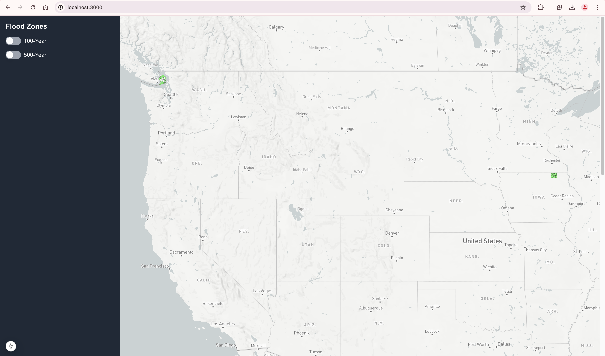

# Next.js Flood Zone Visualization Application

This project is a Next.js (version 15) application designed to visualize FEMA flood risk zones (e.g., 100-year and 500-year zones) using Mapbox. The app allows users to explore flood zones on an interactive map, click on specific zones to display detailed information in a popup, and toggle between different zones using a sidebar.

---

## Prerequisites

- **Node.js**: v18 (required)  
- **NPM**: Use the latest version compatible with Node.js 18.  

---

## Getting Started

### 1. Installation

1. Clone the repository:
   ```bash
   git clone <repository-url>

2.	Navigate to the project directory:
   ```bash
   cd flood-risk-mapper

3. Install dependencies:
   ```bash
   npm install

4. Environment Configuration

The application requires some environment variables for Mapbox integration.

For now, environment variables are included in the .env file in the repository for demo purposes. Ideally, these keys should be part of a secure CI/CD pipeline, but this is a temporary arrangement.

- .env File Contents:
   ```env
   NEXT_PUBLIC_MAPBOX_TOKEN=<your-mapbox-access-token>
   NEXT_PUBLIC_MAP_API_BASE_URL=<your-mapbox-base-api-url>
 

5. Run the application:
    ```bash
    npm run dev

The application will start on http://localhost:3000.

6. Build for Production:
    ```bash
    npm run build

Then, start the application:
    
    npm start
    
## Features


 1. Interactive Map: Visualizes flood zones (100-year and 500-year)
with distinct colors: Red: 100-year flood zones Blue: 500-year flood
zones Green: Other zones or unknown categories 
2. Popup on Zone Click:
Clicking on a zone displays detailed information about the flood zone
in a popup. 
3. Dynamic Zone Assignment: Flood zones are randomly
assigned during rendering (e.g., 100-year or 500-year zones). The data
may change on each preview, but the functionality remains consistent. 
4.
Mapbox Integration: Map style optimized for clear visibility of flood
zones. 
5. Future Improvements: Better file separation. Improved
coding standards.

**Known Limitations**

1. Random Data Assignment: The flood zones are randomly assigned for demo
purposes. This behavior might not reflect real-world data but
demonstrates the application's functionality. 
2. Environment Keys in Repo: Currently, the environment keys are pushed to the repository.
These should be managed securely through a pipeline in the future.

## Folder Structure

```
src/ 
├── components/ # Reusable components (e.g., Map, Sidebar, Popups)
├── contexts/ # React Contexts for state management (e.g., selected zones) 
├── app/ # Next.js pages 
├── styles/ # Tailwind CSS files 
├── utils/ # Helper functions and constants
```

## Usage

1. Open the application in a browser. 
2. Interact with the map to explore flood zones. 
3. Click on a zone to display its details in a popup. 
4. Use the sidebar to toggle between flood zone types (e.g.,100-year and 500-year).

**Future Enhancements**

1. Secure Environment Keys: Transition to a CI/CD pipeline for secure environment variable management. 
2. Enhanced Codebase: Introduce better
file separation and adhere to coding standards for maintainability and
scalability. 
3. Realistic Zone Data: Replace random data assignments with real-time or static data for better accuracy.

**Troubleshooting**

1. Map Not Loading: Ensure the NEXT_PUBLIC_MAPBOX_TOKEN in the .env file is valid. 
2. Node Version Mismatch: Use Node.js v18. Check your version with node -v.

## Demo
[Demo Link](https://flood-risk-mapper.vercel.app/)

Screenshots:




